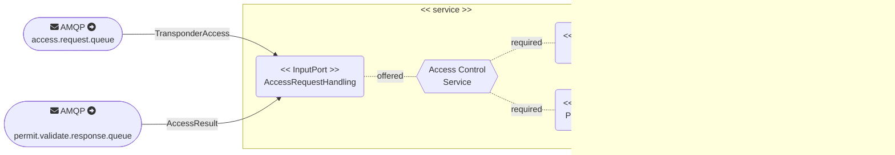
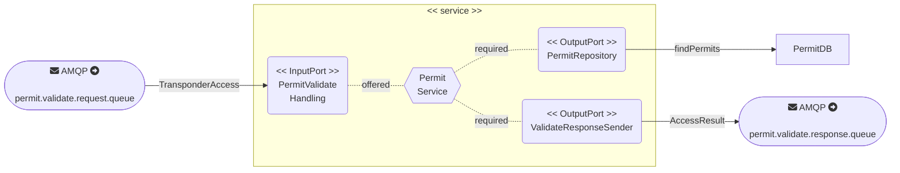

# ACME PARK! MVP

- Authors: Billy Chan
- Version: 2024.10

## Abstract
This repository is the MVP for *Case Study: The ACME Park! product* demonstrating the situation: 

members present their transponder at the gate, and the gate is opened if they have a valid permit.

## Prerequisite
- Java 21+
- python 3.10
- Docker

## Overall Description

- `infrastructure`: contains the _technical_ services used to support the ACME PARK! MVP
    - `message-broker`: A RabbitMQ server to support event-driven architectures using MQTT and AMQP protocols.
      - AMQP was used in this project
      - Message Queue was used for inter-service communication
    - `service-registry`: An Eureka server (Netflix) to support service discovery
- `services`: The business services used to support ACME PARK! MVP
    - `access-control-service`: service to receive transponder access request sent by client and forward them to permit service for validation
    - `permit-service` service to receive validation request sent by `gate-service` and give back the result to gate-service
- `clients`: External (non-service-based artefacts) consuming the ACME PARK! services
    - `gate-transponder-scanner-client`: a simulator pretending transponder scanned event sending data to the  `gate-service`
## Services location

**If you're on a Mac**, you might encounter issues using `localhost` (it might take some time to be available, or be blocked once and foor all). You can always refer to the direct IP address of localhost (`127.0.0.1`) to bypass this situation.

- Infrastructure:
    - RabbitMQ Management web interface: <http://localhost:8080> (login: `admin`, password: `cas735`)
    - Eureka registry: <http://locahost:8761>, there are no usecases for MVP. Services are communicated in message queues.
- Business Services:
    - Access Control Service <http://locahost:8081>
    - Permit Service <http://localhost:8082>

## How to operate?

The Maven wrapper is used to make sure that the Maven build has all the required components to run the project. 
You can access it`./mvnw --help`


### Compiling the micro-services

```
acme-park-mvp $ ./mvnw clean package
```

### Building the turn-key services

```
acme-park-mvp $ cd deployment
deployment $ docker compose build --no-cache
```

### Starting the complete system

```
deployment $ docker compose up -d
```

### Shutting down the system

```
deployment $ docker compose down
```

### Client
- The client side is simulating two gates scanning the transponders(`T_001`. `T_002`).
- This script connects to RabbitMQ and simulates two gates (E1, E2) processing transponder IDs. 
- It sends access requests, validates a transponder, and listens for commands to open or not open gates. 
- The `T_001` is valid while `T_002` is expired.
- 
```bash
  client $ pipenv shell
  client $ pipenv install
  client $ python ./gate-client-simulation.py
```


## Overall Flowchart

### Gate Access Service

### Permit Service
